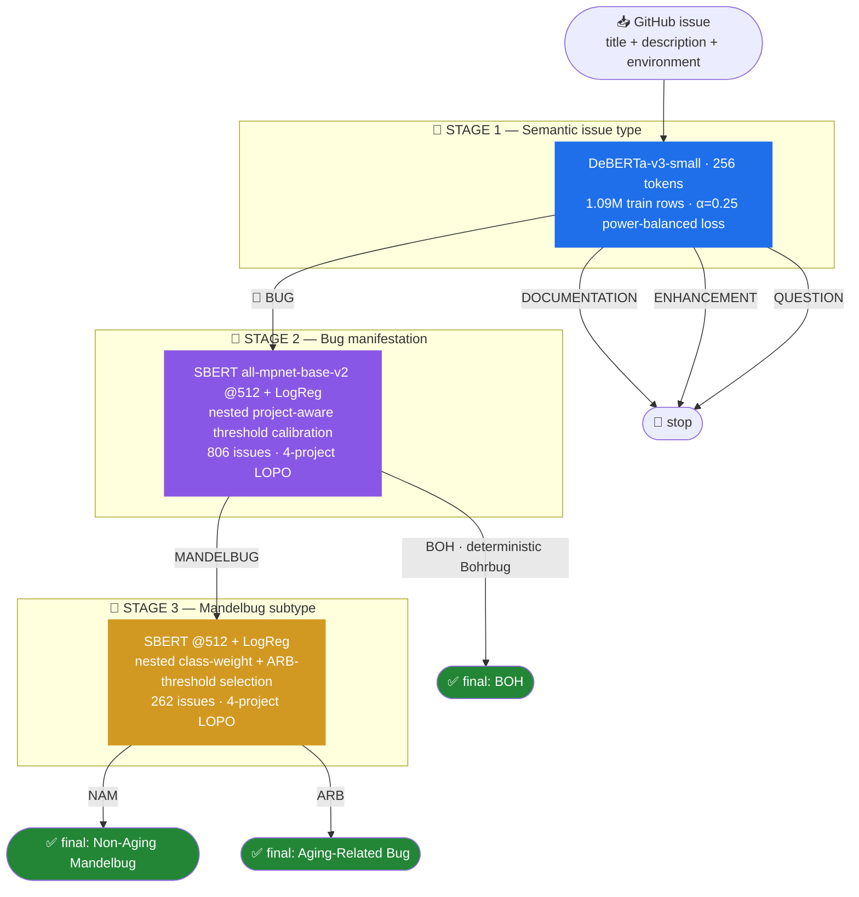
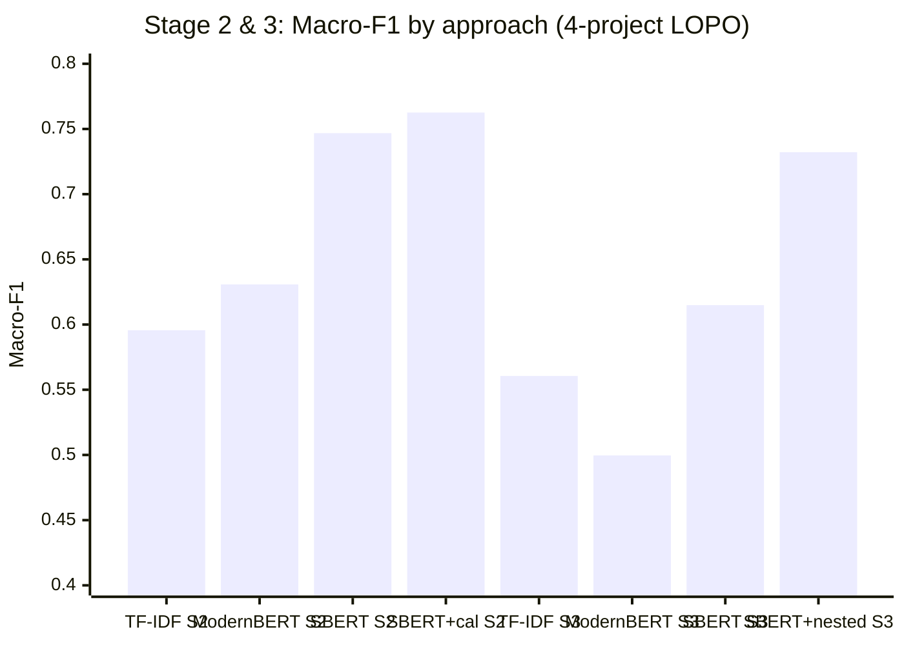
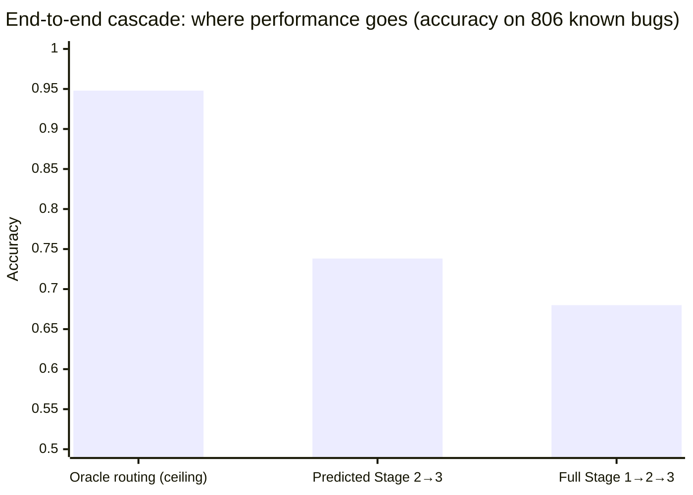
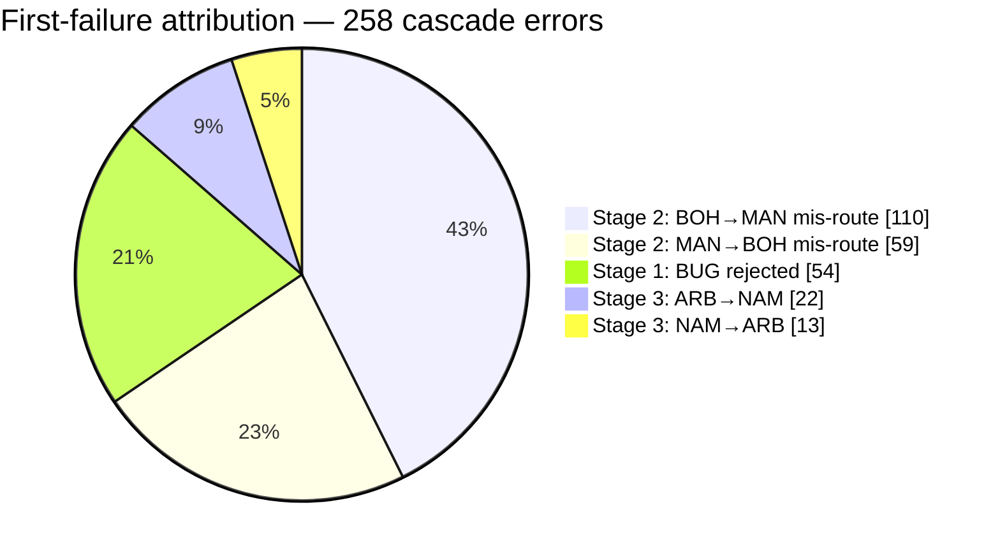

<div align="center">

# 🐛 BugClassiNet

### From raw GitHub issue text to a fine-grained bug taxonomy — one reproducible, imbalance-aware, three-stage cascade.


**Stage 1** · Macro-F1 **0.7934** &nbsp;|&nbsp; **Stage 2** · Macro-F1 **0.7626** &nbsp;|&nbsp; **Stage 3** · Macro-F1 **0.7322** &nbsp;|&nbsp; **Cascade ceiling** · **0.9479** acc

</div>

---

## 🧭 The pipeline at a glance



> **Why hierarchical?** Bohrbugs reproduce deterministically; Mandelbugs (timing, environment, aging effects) do not — and Aging-Related Bugs need proactive mitigation like rejuvenation. Routing issues down this taxonomy at *triage time*, from initial report text alone, is the research question.

---

## 🏆 Headline results

| Stage | Task | Data | Final frozen model | Macro-F1 | Other |
|:---:|---|---|---|:---:|---|
| **1️⃣** | `BUG` / `DOC` / `ENH` / `QUESTION` | NLBSE 2023 · 142,320 official test | DeBERTa-v3-small · 2 epochs · α=0.25 | **0.7934** | Micro-F1 0.8848 · MCC 0.8016 |
| **2️⃣** | `BOH` vs `MANDELBUG` | 806 issues · AXIS/HTTPD/Linux/MySQL | SBERT @512 + LogReg + nested calibration | **0.7626** | Acc 0.7816 · MCC 0.5332 |
| **3️⃣** | `NAM` vs `ARB` | 262 Mandelbugs | SBERT @512 + LogReg + nested selection | **0.7322** | Acc 0.8397 · ARB F1 0.5625 |
| **🔗** | Full cascade (806 known bugs) | Stage 1→2→3, argmax gate | all three frozen stages | **0.6126** | Acc 0.6799 · oracle ceiling 0.9479 |

### 📈 How each stage was won — decision design beat bigger models





### 🔥 Where the errors live



**Stage 2 routing is the bottleneck (65.5% of final errors)** — improving it, not Stage 3, is the highest-value future work. Stage 1 retains **93.3%** of known bugs and **98.85%** of Mandelbugs.

---

## 🔬 Research story, stage by stage

<details>
<summary><b>1️⃣ Stage 1 — Million-scale semantic issue classification</b> (click to expand)</summary>

**Dataset:** NLBSE 2023 — 1,089,694 leakage-cleaned training rows, 121,078 validation, 142,320 untouched official test.

- 🧹 **Leakage-aware pipeline** — dedup (57,048 rows removed), source-ID disambiguation, explicit official-test overlap removal (10,011 → 0), SHA-256 source identity.
- 📊 **Strong classical baseline first** — TF-IDF scaled 200K → 2M word features: Macro-F1 0.7402 → 0.7643, diminishing returns quantified.
- ⚖️ **Key imbalance finding** — inverse-frequency class weighting *over-corrects* minorities (QUESTION: recall 0.74 but precision 0.47). A mild **power-balanced loss (α = 0.25)** gave the best Macro-F1 trade-off across a controlled weighting continuum.
- ⏱️ **Ablations** — 2 epochs ≫ 1 epoch; 384 tokens did **not** beat 256 despite 32.5% truncation (+49% eval cost for nothing).
- 🛠️ **Engineering** — host RAM cut from ~30 GiB to single-digit GiB (disk-backed Arrow, batched tokenization, dynamic padding); robust cross-session Kaggle checkpoint/resume with strict state verification.
- ✅ **Generalization** — validation 0.7927 vs official test **0.7934** Macro-F1: essentially identical.

| Class | Test F1 |
|---|---:|
| BUG | 0.9215 |
| ENHANCEMENT | 0.8916 |
| DOCUMENTATION | 0.7144 |
| QUESTION | 0.6462 |

</details>

<details>
<summary><b>2️⃣ Stage 2 — Bohrbug vs Mandelbug across projects</b> (click to expand)</summary>

**Dataset:** 806 reconstructed issues (544 BOH / 262 MANDELBUG) from **AXIS, HTTPD, Linux, MySQL**. Evaluation is strict **leave-one-project-out** — the test project never influences training *or* threshold selection.

- 🥇 **SBERT embeddings + logistic regression beat everything**: TF-IDF 0.5956, ModernBERT fine-tuning 0.6308 ± 0.0291, SBERT @512 **0.7468** → **0.7626** with calibration.
- 🎚️ **Leakage-free nested threshold calibration** — inner LOPO on the three training projects picks the decision threshold; applied once to the untouched outer project. Cuts BOH→MANDELBUG false positives 139 → 115.
- 📝 **Triage-time evidence wins** — full comment threads (retrospective) did not beat title + initial description + environment for the final model.
- ❄️ **Negative result kept honest** — freezing 8 lower ModernBERT layers made everything worse (0.6263 → 0.5935).

</details>

<details>
<summary><b>3️⃣ Stage 3 — Non-Aging Mandelbug vs Aging-Related Bug</b> (click to expand)</summary>

**Dataset:** 262 Mandelbugs (207 NAM / 55 ARB) — small, imbalanced, and project-heterogeneous (AXIS is 53% ARB; Linux only 17%).

- 🎯 **The gain came from decision design, not a bigger encoder** — nested selection of class weighting *and* ARB threshold lifted Macro-F1 0.6149 → **0.7322** and ARB recall 0.20 → **0.49**.
- 🚫 **ModernBERT rejected** — near chance (0.4996 Macro-F1, MCC 0.05) at seed 42; screen not worth expanding.
- 🗣️ Full discussion threads again *hurt* (0.6778 vs 0.7322) — they double NAM→ARB false positives.
- 🧩 **Errors are structured** — Linux dominates ARB misses (20/28), MySQL dominates NAM false positives (10/14); deadlock/timing language overlaps both classes.

</details>

<details>
<summary><b>🔗 Routing evaluation — the frozen cascade end-to-end</b> (click to expand)</summary>

All three frozen stages joined on 806 known-BUG reports (no threshold retuned on the pooled cohort):

| Mode | Correct | Accuracy | Macro-F1 |
|---|:---:|:---:|:---:|
| 🟢 Oracle Stage-2 routing (ceiling) | 764 / 806 | **0.9479** | 0.8215 |
| 🟡 Predicted Stage 2 → 3 | 595 / 806 | 0.7382 | 0.6271 |
| 🔵 Full Stage 1 → 2 → 3 (argmax gate) | 548 / 806 | **0.6799** | 0.6126 |

- Stage 1 rejections are concentrated: AXIS + HTTPD account for 50 of 54.
- The oracle ceiling proves the standalone Stage 3 model is *not* the constraint — **routing quality is**.

</details>

📄 **Full reports** (protocols, confusion matrices, ablations, error analyses): [docs/Reports/](docs/Reports/)
— [Stage 1](docs/Reports/BugClassiNet_Research_Report_Stage1.docx) · [Stage 2](docs/Reports/BugClassiNet_Stage2_Research_Report_Updated_Final.docx) · [Stage 3](docs/Reports/BugClassiNet_Stage3_Research_Report_Final.docx) · [Routing](docs/Reports/BugClassiNet_Frozen_Hierarchical_Routing_Evaluation.docx)

---

## 💡 Key takeaways

| # | Finding |
|:---:|---|
| 1 | **Mild power-balanced weighting (α = 0.25) beats inverse-frequency balancing** for imbalanced issue classification — full balancing buys minority recall with severe precision loss. |
| 2 | **Fixed sentence embeddings generalize better than fine-tuned transformers cross-project** in low-data regimes (806 / 262 examples). |
| 3 | **Leakage-free nested threshold/weight selection is a cheap, protocol-clean win** — +1.6 Macro-F1 pts (Stage 2), +11.7 pts (Stage 3), zero model change. |
| 4 | **Triage-time evidence ≥ full discussion threads** — the deployable condition is also the stronger one. |
| 5 | **In a hierarchy, routing dominates** — a 0.95-ceiling cascade lands at 0.68 mostly from Stage 2 mis-routes, not leaf-classifier weakness. |

---

## 🚀 Quick start

```powershell
python -m venv .venv
.venv\Scripts\pip install -r requirements-dev.txt

# Inspect & prepare NLBSE 2023 (leakage-safe, never edits official test)
python -m bugclassinet.cli inspect-archive data/raw/nlbse2023/train.tar.gz
python -m bugclassinet.cli prepare-nlbse --train-archive TRAIN.tar.gz --test-archive TEST.tar.gz

# Classical baseline
python -m bugclassinet.cli train-tfidf --data-dir data/processed/nlbse2023 --output-dir outputs/models/tfidf

# Evaluate the frozen Stage-1 transformer
python -m bugclassinet.cli evaluate-stage1 --model outputs/models/deberta_stage1 --data data/processed/nlbse2023/validation_clean.parquet --output-dir outputs/evaluations/deberta_stage1
```

Transformer training environments additionally need `pip install -r requirements-transformers.txt`.

## 🗂️ Repository layout

```
📦 BugClassiNet-Next
├── 📁 src/bugclassinet/     ← all reusable pipeline / training / eval code (CLI entry: python -m bugclassinet.cli)
├── 📁 configs/              ← YAML presets: models, paths, ablations
├── 📁 notebooks/kaggle/     ← thin Kaggle wrappers around package APIs
├── 📁 docs/
│   ├── 📁 Reports/          ← the four final research reports (.docx)
│   ├── 📄 stage2_mandelbugs.md          ← Stage-2/3 protocol & commands
│   └── 📄 shared_transformer_training.md
├── 📁 tests/                ← pytest suite (synthetic fixtures only)
└── 📄 AGENTS.md             ← contributor rules
```

<details>
<summary><b>⚙️ Full-scale Stage-1 training & evaluation notes</b></summary>

Stage 1 projects only model columns from Parquet into a memory-mapped Arrow
dataset; bounded runs use an exact class-stratified subset (seed 42);
tokenization is disk-cached in bounded batches and padded dynamically per
batch (truncation fixed at 256 tokens).

- Kaggle scaling preset: `configs/models/deberta_stage1_kaggle_1epoch.yaml`. Never pass `--max-eval-samples` — every run evaluates the complete `validation_clean.parquet`.
- Fully resumable checkpoints (`--resume-from-checkpoint`), identified by verified SHA-256 of Parquet inputs; resume rejects any change to dataset, label mapping, model revision, seed, precision, or training config. Legacy `.gamma`/`.beta` LayerNorm checkpoints are remapped in memory.
- Class weighting via `class_weight_strategy`: `balanced`, `sqrt_balanced`, `quarter_balanced` (the final α = 0.25), `none`, or `custom`.
- `evaluate-stage1` disables training, hash-verifies every model parameter before/after, and writes full reports + `evaluation_manifest.json`.

```powershell
python -m bugclassinet.cli evaluate-stage1 --model FINAL_CHECKPOINT --data data/processed/nlbse2023/test.parquet --output-dir outputs/evaluation/stage1_final_test
```

**Closeout evaluations:** `evaluate-stage1-binary` derives BUG vs NON_BUG from
the frozen four-class logits (threshold selected on validation only).
`evaluate-nlbse2024` reports frozen NLBSE 2023 → 2024 cross-dataset transfer
(`feature` ↦ `ENHANCEMENT`; 2024 training data used for schema audit only —
not the official NLBSE 2024 competition protocol).

```powershell
python -m bugclassinet.cli evaluate-stage1-binary --model FINAL_CHECKPOINT --validation data/processed/nlbse2023/validation_clean.parquet --test data/processed/nlbse2023/test.parquet --output-dir outputs/evaluation/stage1_binary
python -m bugclassinet.cli evaluate-nlbse2024 --model FINAL_CHECKPOINT --data data/raw/nlbse2024/issues_test.csv --output-dir outputs/evaluation/nlbse2024_transfer
```

**TF-IDF at scale:** start from `configs/models/tfidf_stage1_word_only.yaml`
(200K features) → `tfidf_stage1_word_only_500k.yaml` → full corpus in separate
processes (`--max-train-samples 200000`, `500000`, then omit).

</details>

<details>
<summary><b>🧪 Stage 2 / 3 Mandelbugs workflow</b></summary>

Audited ARFF labels, cached/manual issue enrichment, four-project LOPO
baselines, optional frozen Stage-1 encoder transfer, and a low-data ModernBERT
trainer. See [docs/stage2_mandelbugs.md](docs/stage2_mandelbugs.md) and
[the Kaggle notebook](notebooks/kaggle/12_stage2_mandelbugs_lopo.ipynb).

Commands: `mandelbugs-audit` · `mandelbugs-enrich` · `mandelbugs-prepare` · `train-stage2-baseline` · `train-stage2-modernbert`

</details>

<details>
<summary><b>☁️ Running on Kaggle</b></summary>

Attach a dataset containing the source archives, install the project package
in a notebook, set `--config configs/paths/kaggle.yaml`, and write artifacts
to `/kaggle/working/outputs`. The provided notebooks are deliberately thin
wrappers around `bugclassinet` package functions.

</details>

## ✅ Quality gates

```powershell
python -m ruff check .
python -m ruff format --check .
pytest
```

Large raw data, processed data, checkpoints, and outputs are Git-ignored.
Official test sets are never edited; labels, statuses, and resolutions never
enter model input text.

## ⚠️ Honest limitations

- Stage 2/3 datasets are small (806 / 262 issues) and imbalanced; per-project estimates carry high variance.
- Only four projects back the cross-project claims — no independent fifth project was available for external validation.
- The cascade result measures subtype recovery among *known* bugs; it is not a global six-class production accuracy.
- Stage 1 development splits are stratified, not repository-aware (the NLBSE archive exposed no repository metadata).
